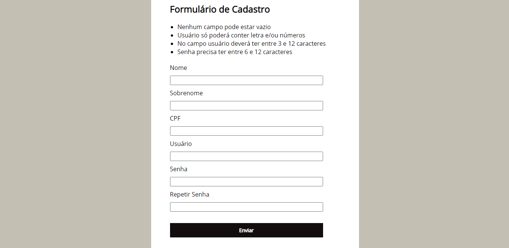

#  📄 Formulário de Cadastro
Este projeto é baseado no curso [JavaScript e TypeScript do básico ao avançado](https://www.udemy.com/course/curso-de-javascript-moderno-do-basico-ao-avancado/). Sua funcionalidade é validação de formulário.

## 🚀 Technologias
- HTML
- CSS
- Javascript

### 😉 Made by Marcia